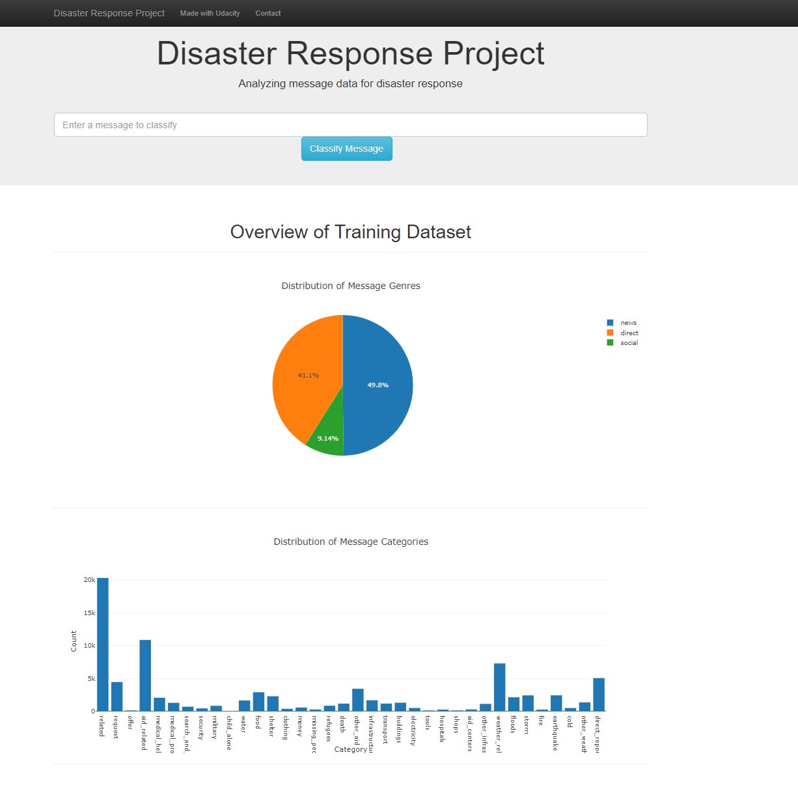
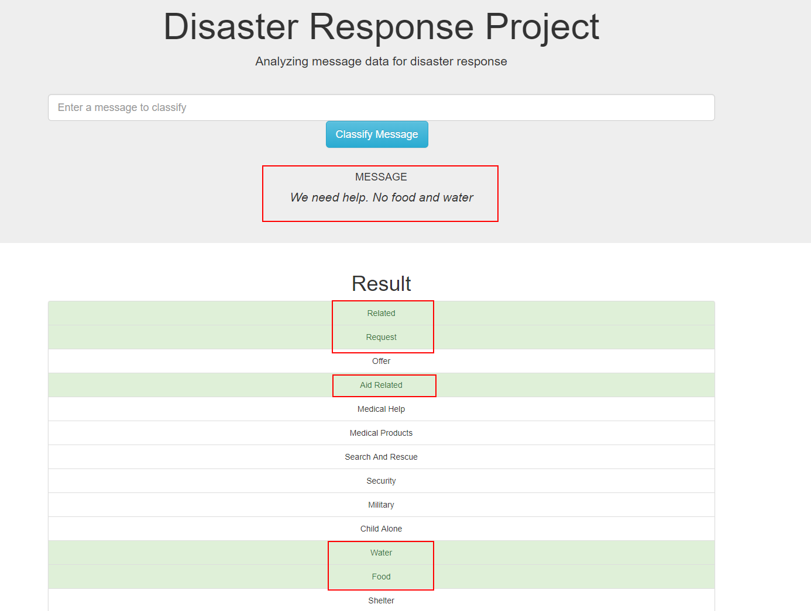
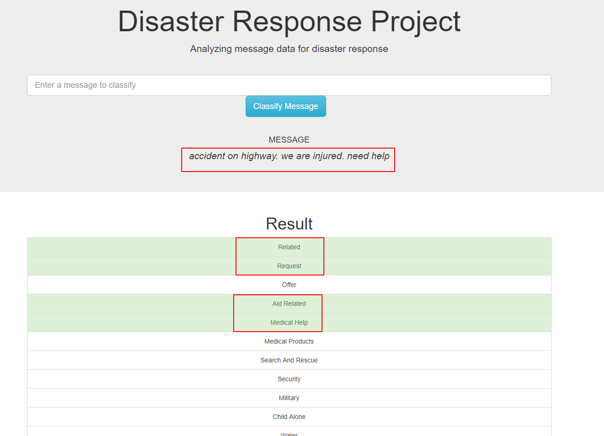

# Disaster Response Pipeline Project

## Project Motivation

In this project, I apply skills I learned in Data Engineering Section to analyze disaster data from Figure Eight to build a ML model to classify disaster messages.

## Process Flow
  - Clean and Store the Data (process_data.py)
    - The message data is cleaned and stored into a sqlite database
  - Create, Train and Store Classifier (train_classifier.py)
    - The train_classifier.py script takes the database file path and model file path, creates and trains a classifier, and stores the classifier into a pickle file to the specified model file path.
    - The script uses a custom tokenize function using nltk to case normalize, lemmatize, and tokenize text. This function is used in the machine learning pipeline to vectorize and then apply TF-IDF to the text.
    - The script builds a pipeline that processes text and then performs multi-output classification on the 36 categories in the dataset. GridSearchCV is used to find the best parameters for the model.
  - Web app
    - the home page has visualization showing classification of the messages
    - The user can enter a message and view how the model classifies the message based on the trained model
    
## File Description
    .
    ├── app     
    │   ├── run.py                           # Flask file that runs app
    │   └── templates   
    │       ├── go.html                      # Classification result page of web app
    │       └── master.html                  # Main page of web app    
    ├── data                   
    │   ├── disaster_categories.csv          # Dataset including all the categories  
    │   ├── disaster_messages.csv            # Dataset including all the messages
    │   └── process_data.py                  # Data cleaning
    ├── models
    │   └── train_classifier.py              # Train ML model           
    └── README.md

### Instructions:
1. Run the following commands in the project's root directory to set up your database and model.

    - To run ETL pipeline that cleans data and stores in database
        `python data/process_data.py data/disaster_messages.csv data/disaster_categories.csv data/DisasterResponse.db`
    - To run ML pipeline that trains classifier and saves
        `python models/train_classifier.py data/DisasterResponse.db models/classifier.pkl`

2. Run the following command in the app's directory to run your web app.
    `python run.py`

3. Go to http://0.0.0.0:3001/

## Examples

  - Message 1 : We need help. no food and water.

  - Message 2 : accident on highway. we are injured. need help.

